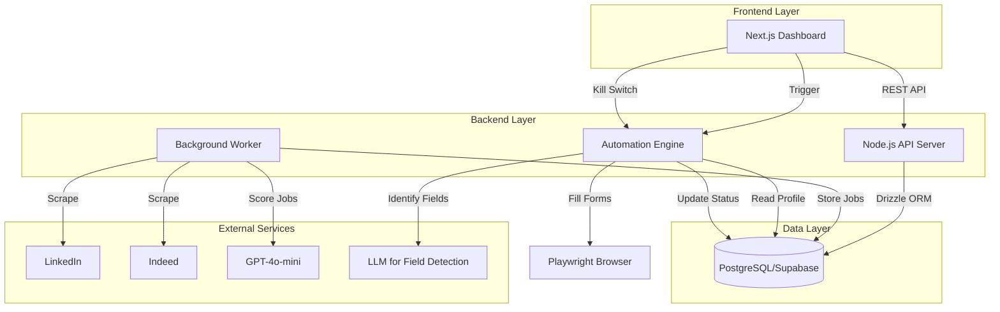
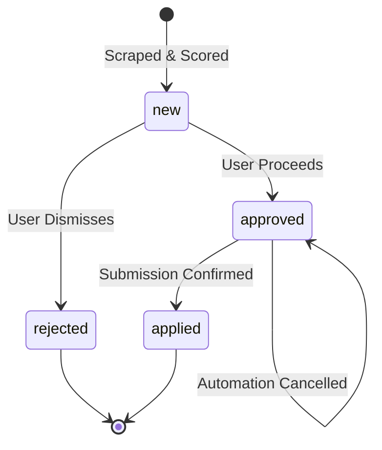
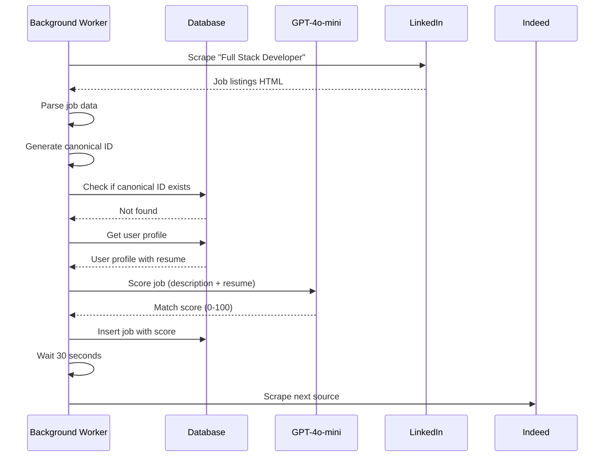
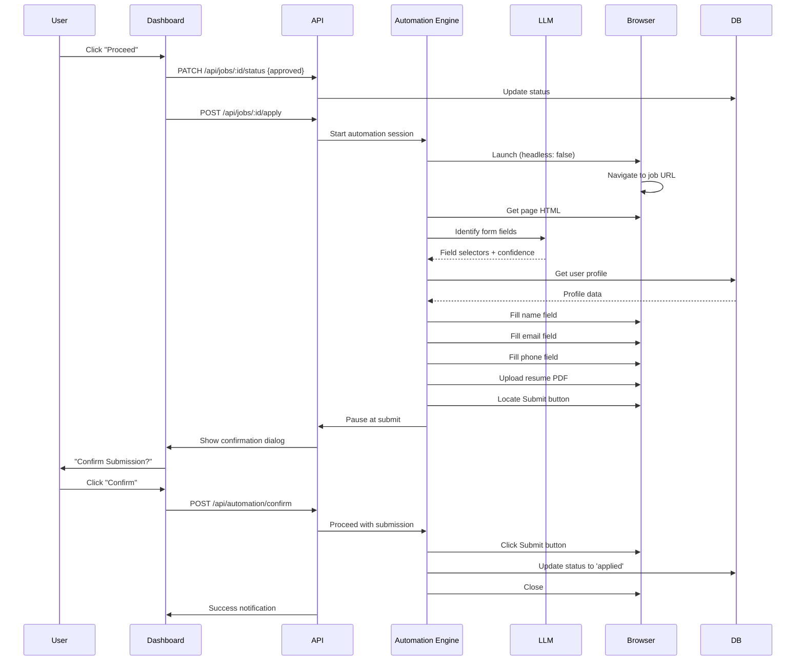

# Design Document: Human-in-the-Loop Job Search & Application Agent

## Overview

The Human-in-the-Loop Job Search & Application Agent is a full-stack web application that automates job discovery and application submission while maintaining human oversight. The system consists of:

- **Frontend**: Next.js application with Tailwind CSS and ShadcnUI for the dashboard interface
- **Backend**: Node.js (TypeScript) API with Drizzle ORM for database operations
- **Database**: PostgreSQL hosted on Supabase
- **Background Worker**: Node.js service for job scraping using Playwright
- **Automation Engine**: Playwright + AgentQL for intelligent form filling
- **AI Components**: GPT-4o-mini for job scoring and LLM-based form field identification

The architecture follows a clear separation between automated processes and human decision points, ensuring users maintain control over their job applications while benefiting from automation for repetitive tasks.

## Architecture

### System Components



### Component Responsibilities

1. **Next.js Dashboard (Frontend)**
   - Display job listings with filtering and sorting
   - Provide Proceed/Dismiss actions for job triage
   - Show automation status and confirmation dialogs
   - Implement Kill Switch UI control
   - Manage user profile editing

2. **Node.js API Server (Backend)**
   - RESTful endpoints for job CRUD operations
   - User profile management endpoints
   - WebSocket or Server-Sent Events for real-time automation status
   - Authentication and session management
   - Coordination between components

3. **Background Worker**
   - Scheduled job scraping from LinkedIn and Indeed
   - Canonical ID generation and duplicate detection
   - Job scoring via GPT-4o-mini
   - Rate limiting and ethical scraping controls

4. **Automation Engine**
   - Playwright browser orchestration
   - LLM-based form field identification
   - Form filling with user profile data
   - Pause-and-confirm workflow before submission
   - Kill switch response handling

## Components and Interfaces

### Database Schema (Drizzle ORM)

```typescript
// schema/jobs.ts
export const jobs = pgTable('jobs', {
  id: serial('id').primaryKey(),
  jobUrl: text('job_url').notNull().unique(),
  company: text('company').notNull(),
  title: text('title').notNull(),
  description: text('description').notNull(),
  matchScore: integer('match_score'),
  status: pgEnum('status', ['new', 'rejected', 'approved', 'applied']).notNull().default('new'),
  createdAt: timestamp('created_at').notNull().defaultNow(),
});

// schema/userProfile.ts
export const userProfile = pgTable('user_profile', {
  id: serial('id').primaryKey(),
  fullName: text('full_name').notNull(),
  email: text('email').notNull(),
  phone: text('phone'),
  githubUrl: text('github_url'),
  resumeText: text('resume_text').notNull(),
  bio: text('bio'),
  desiredRoles: text('desired_roles'), // e.g., "Full Stack Developer, React Engineer"
  excludedKeywords: text('excluded_keywords'), // e.g., "military, defense, government"
  preferredTechnologies: text('preferred_technologies'), // e.g., "React, Node.js, TypeScript"
});
```

### API Endpoints

```typescript
// GET /api/jobs?status=new&minScore=70
// Returns: Job[]
interface Job {
  id: number;
  jobUrl: string;
  company: string;
  title: string;
  description: string;
  matchScore: number | null;
  status: 'new' | 'rejected' | 'approved' | 'applied';
  createdAt: string;
}

// PATCH /api/jobs/:id/status
// Body: { status: 'rejected' | 'approved' | 'applied' }
// Returns: Job

// POST /api/jobs/:id/apply
// Triggers automation engine for the specified job
// Returns: { automationId: string }

// POST /api/automation/confirm
// Body: { automationId: string }
// Confirms submission and clicks Submit button
// Returns: { success: boolean }

// POST /api/automation/cancel
// Body: { automationId: string }
// Cancels automation and closes browser
// Returns: { success: boolean }

// POST /api/automation/kill
// Emergency kill switch - terminates all active automations
// Returns: { terminated: number }

// GET /api/profile
// Returns: UserProfile

// PUT /api/profile
// Body: UserProfile
// Returns: UserProfile
```

### Background Worker Interface

```typescript
interface ScraperConfig {
  sources: ('linkedin' | 'indeed')[];
  searchQueries: string[]; // Multiple personalized queries
  delayBetweenRequests: number; // milliseconds
  maxJobsPerRun: number;
}

interface ScrapedJob {
  url: string;
  company: string;
  title: string;
  description: string;
}

interface JobTitleGenerationResult {
  jobTitles: string[]; // 1-3 personalized job titles
  reasoning: string; // Why these titles were chosen
  technologies: string[]; // Key technologies extracted
}

class BackgroundWorker {
  async generatePersonalizedJobTitles(
    resumeText: string,
    desiredRoles?: string,
    excludedKeywords?: string,
    preferredTechnologies?: string
  ): Promise<JobTitleGenerationResult>;
  async scrapeJobs(config: ScraperConfig): Promise<ScrapedJob[]>;
  async generateCanonicalId(company: string, title: string): Promise<string>;
  async checkDuplicate(canonicalId: string): Promise<boolean>;
  async scoreJob(jobDescription: string, resumeText: string): Promise<number>;
  async storeJob(job: ScrapedJob, score: number): Promise<void>;
}
```

### LLM Prompt for Job Title Generation

```typescript
const JOB_TITLE_GENERATION_PROMPT = `
You are a career advisor analyzing a resume to generate personalized job search queries.

Resume:
{resumeText}

User's Desired Roles (if specified): {desiredRoles}
User's Excluded Keywords: {excludedKeywords}
User's Preferred Technologies: {preferredTechnologies}

Instructions:
1. If desired_roles are specified, use those as the primary job titles
2. Otherwise, analyze the resume focusing on the MOST RECENT 2-3 years of experience
3. Identify the user's current career focus and key technologies
4. Generate 1-3 job titles that match their current skills and career trajectory
5. EXCLUDE any roles related to: {excludedKeywords}
6. PRIORITIZE roles that use: {preferredTechnologies}
7. Ignore outdated experience (e.g., if they have military experience from 5+ years ago but recent tech experience, focus on tech roles)

Return JSON format:
{
  "jobTitles": ["Senior React Developer", "Full Stack Engineer"],
  "reasoning": "Based on 3 years of React and Node.js experience in recent roles",
  "technologies": ["React", "Node.js", "TypeScript", "PostgreSQL"]
}
`;
```

### Automation Engine Interface

```typescript
interface AutomationSession {
  id: string;
  jobId: number;
  browser: Browser;
  page: Page;
  status: 'filling' | 'paused' | 'submitted' | 'cancelled' | 'error';
}

interface FormField {
  type: 'text' | 'email' | 'tel' | 'file' | 'textarea';
  selector: string;
  label: string;
  confidence: number;
}

class AutomationEngine {
  async startSession(jobId: number): Promise<AutomationSession>;
  async identifyFormFields(page: Page): Promise<FormField[]>;
  async fillField(field: FormField, value: string | File): Promise<void>;
  async pauseAtSubmit(sessionId: string): Promise<void>;
  async confirmSubmission(sessionId: string): Promise<void>;
  async cancelSession(sessionId: string): Promise<void>;
  async killAllSessions(): Promise<number>;
}
```

### LLM Integration for Form Field Detection

The system uses an LLM (via LangChain or CrewAI) to identify form fields intelligently:

```typescript
interface FieldDetectionPrompt {
  pageHtml: string;
  targetFields: string[]; // ['name', 'email', 'phone', 'resume', 'github']
}

interface FieldDetectionResponse {
  fields: {
    fieldType: string;
    selector: string;
    confidence: number;
    reasoning: string;
  }[];
}

// Prompt template for field detection
const FIELD_DETECTION_PROMPT = `
You are analyzing a job application form. Given the HTML structure, identify the CSS selectors for the following fields:
- Full Name input
- Email input
- Phone number input
- Resume/CV file upload
- GitHub/Portfolio URL input

For each field found, provide:
1. The CSS selector
2. Confidence score (0-1)
3. Brief reasoning

HTML:
{pageHtml}

Return JSON format with fields array.
`;
```

## Data Models

### Job Record Lifecycle



### Canonical ID Generation

To prevent duplicate job entries, we generate a canonical ID from company name and job title:

```typescript
function generateCanonicalId(company: string, title: string): string {
  const normalize = (str: string) => 
    str.toLowerCase()
       .replace(/[^a-z0-9]+/g, '-')
       .replace(/^-|-$/g, '');
  
  return `${normalize(company)}__${normalize(title)}`;
}

// Example:
// generateCanonicalId("Google Inc.", "Senior Full Stack Developer")
// Returns: "google-inc__senior-full-stack-developer"
```

### User Profile Model

```typescript
interface UserProfile {
  id: number;
  fullName: string;
  email: string;
  phone?: string;
  githubUrl?: string;
  resumeText: string; // Plain text or markdown
  bio?: string;
  desiredRoles?: string; // Comma-separated: "Full Stack Developer, React Engineer"
  excludedKeywords?: string; // Comma-separated: "military, defense, government"
  preferredTechnologies?: string; // Comma-separated: "React, Node.js, TypeScript"
}

// Resume PDF generation
async function generateResumePdf(resumeText: string): Promise<Buffer> {
  // Convert markdown/text to PDF using library like puppeteer or pdfkit
  // Return buffer for file upload
}
```

## Data Flow Examples

### Job Discovery Flow



### Application Automation Flow




## Correctness Properties

*A property is a characteristic or behavior that should hold true across all valid executions of a system—essentially, a formal statement about what the system should do. Properties serve as the bridge between human-readable specifications and machine-verifiable correctness guarantees.*

### Property 1: Canonical ID Determinism
*For any* company name and job title pair, generating the canonical ID multiple times should always produce the same result, and the result should be a valid slug format (lowercase alphanumeric with hyphens).

**Validates: Requirements 1.3**

### Property 2: Duplicate Prevention
*For any* job with a canonical ID that already exists in the database, attempting to insert it should result in no new database record being created, and the original record should remain unchanged.

**Validates: Requirements 1.4**

### Property 3: New Job Insertion
*For any* job with a unique canonical ID, inserting it into the database should result in exactly one new record with status 'new' and a valid created_at timestamp.

**Validates: Requirements 1.5, 8.5**

### Property 4: Scrape Rate Limiting
*For any* sequence of scrape requests to the same domain, the time elapsed between consecutive requests should be at least 30 seconds.

**Validates: Requirements 1.6, 9.1**

### Property 5: Job Data Extraction Completeness
*For any* scraped job posting HTML, the parser should extract all required fields (job URL, company name, job title, description), and none of these fields should be empty or null.

**Validates: Requirements 1.2**

### Property 6: Match Score Range Validation
*For any* valid GPT-4o-mini response, the extracted match score should be an integer between 0 and 100 inclusive.

**Validates: Requirements 2.3**

### Property 7: Profile Update Round Trip
*For any* valid user profile update, saving the profile and then immediately retrieving it should return an equivalent profile object with all fields matching the saved values.

**Validates: Requirements 3.3**

### Property 8: Email Validation
*For any* string, the email validator should correctly identify whether it matches valid email format (contains @ symbol, valid domain structure).

**Validates: Requirements 3.2**

### Property 9: Dashboard Job Filtering and Sorting
*For any* set of jobs in the database, querying for 'new' status jobs should return only jobs with status 'new', ordered by match_score in descending order, with no jobs of other statuses included.

**Validates: Requirements 4.1**

### Property 10: Job Card Rendering Completeness
*For any* job record, the rendered job card HTML should contain the company name, job title, match score, and description text.

**Validates: Requirements 4.2**

### Property 11: Job Status State Machine
*For any* job record, the following state transitions should be valid and enforced:
- 'new' → 'approved' (user proceeds)
- 'new' → 'rejected' (user dismisses)
- 'approved' → 'applied' (submission confirmed)
- 'approved' → 'approved' (automation cancelled)

And the following transitions should be invalid:
- 'rejected' → any other status
- 'applied' → any other status
- Any status → 'new'

**Validates: Requirements 4.3, 4.4, 6.3, 6.4**

### Property 12: Form Field Filling Correctness
*For any* identified form field (name, email, phone, github) and corresponding user profile data, filling the field should result in the field's value matching the profile data exactly.

**Validates: Requirements 5.4, 5.5, 5.6, 5.7**

### Property 13: Resume PDF Round Trip
*For any* resume text, generating a PDF and then extracting text from that PDF should produce text that contains all the key information from the original resume text.

**Validates: Requirements 5.8**

### Property 14: Automation Pause Before Submission
*For any* automation session, after all form fields are filled, the automation should be in 'paused' status and the submit button should not have been clicked.

**Validates: Requirements 5.9, 6.5**

### Property 15: Kill Switch Termination
*For any* set of active automation sessions, activating the kill switch should result in all browser instances being closed and all sessions having status 'cancelled' or 'terminated'.

**Validates: Requirements 7.2, 7.3**

### Property 16: Database Unique Constraint Enforcement
*For any* job URL that already exists in the database, attempting to insert another job with the same URL should fail with a unique constraint violation error.

**Validates: Requirements 8.2**

### Property 17: Status ENUM Constraint Enforcement
*For any* invalid status value (not in ['new', 'rejected', 'approved', 'applied']), attempting to set a job's status to that value should fail with a constraint violation error.

**Validates: Requirements 8.3**

### Property 18: User-Agent Header Presence
*For any* HTTP request made by the background worker, the request headers should include a User-Agent field that identifies the scraper.

**Validates: Requirements 9.2**

### Property 19: Robots.txt Compliance
*For any* URL that is disallowed in the target site's robots.txt file, the background worker should not attempt to scrape that URL.

**Validates: Requirements 9.3**

### Property 20: Exponential Backoff on Rate Limiting
*For any* sequence of scrape attempts that receive 429 responses, the delays between retry attempts should follow the exponential backoff pattern: 60 seconds, 120 seconds, 240 seconds.

**Validates: Requirements 9.4**

### Property 21: Error Resilience and Continuation
*For any* component error (scraping failure, scoring failure, field detection failure, browser crash), the system should log the error, handle it gracefully without crashing, and continue processing other jobs or tasks.

**Validates: Requirements 10.1, 10.2, 10.3, 10.4**

### Property 22: Event Logging Completeness
*For any* significant system event (kill switch activation, rate limit encounter, error occurrence), a log entry should be created with a timestamp and relevant event details.

**Validates: Requirements 7.4, 9.5**

## Error Handling

### Error Categories and Strategies

1. **Network Errors (Scraping)**
   - **Timeout**: Retry with exponential backoff (5s, 10s, 20s)
   - **Connection refused**: Log error, skip to next source
   - **429 Rate Limit**: Exponential backoff (60s, 120s, 240s)
   - **4xx/5xx errors**: Log error, continue with next job

2. **LLM API Errors (Scoring & Field Detection)**
   - **Timeout**: Retry up to 3 times with 5-second delays
   - **Rate limit**: Wait and retry with exponential backoff
   - **Invalid response**: Set match_score to null, mark for manual review
   - **API key invalid**: Alert admin, pause scoring until resolved

3. **Browser Automation Errors**
   - **Page load timeout**: Retry once, then notify user for manual application
   - **Element not found**: Use LLM to re-identify fields, fallback to manual
   - **Browser crash**: Log error, reset job status to 'approved', notify user
   - **Upload failure**: Retry once, then notify user

4. **Database Errors**
   - **Connection lost**: Retry with exponential backoff, queue operations
   - **Unique constraint violation**: Log as duplicate, skip insertion
   - **Query timeout**: Retry with longer timeout, alert if persistent

### Error Response Format

```typescript
interface ErrorResponse {
  error: {
    code: string; // e.g., "SCRAPE_FAILED", "LLM_TIMEOUT"
    message: string; // User-friendly message
    details?: any; // Technical details for logging
    retryable: boolean;
    timestamp: string;
  };
}
```

### Graceful Degradation

- If scoring fails, jobs are still stored with null match_score for manual review
- If field detection fails, user is notified to apply manually
- If automation crashes, job remains in 'approved' state for retry
- If database is temporarily unavailable, operations are queued in memory

## Testing Strategy

### Dual Testing Approach

This system requires both **unit tests** and **property-based tests** for comprehensive coverage:

- **Unit tests**: Verify specific examples, edge cases, and integration points
- **Property tests**: Verify universal properties across randomized inputs

### Property-Based Testing Configuration

We will use **fast-check** (for TypeScript/Node.js) as our property-based testing library.

**Configuration requirements:**
- Minimum 100 iterations per property test
- Each test must reference its design document property
- Tag format: `// Feature: job-search-agent, Property {number}: {property_text}`

**Example property test structure:**

```typescript
import fc from 'fast-check';

// Feature: job-search-agent, Property 1: Canonical ID Determinism
test('canonical ID generation is deterministic', () => {
  fc.assert(
    fc.property(
      fc.string(), // company name
      fc.string(), // job title
      (company, title) => {
        const id1 = generateCanonicalId(company, title);
        const id2 = generateCanonicalId(company, title);
        
        // Should be deterministic
        expect(id1).toBe(id2);
        
        // Should be valid slug format
        expect(id1).toMatch(/^[a-z0-9-]+__[a-z0-9-]+$/);
      }
    ),
    { numRuns: 100 }
  );
});
```

### Unit Testing Focus Areas

Unit tests should focus on:

1. **Specific Examples**
   - Canonical ID generation with known inputs
   - Email validation with common valid/invalid formats
   - Status transitions with specific job states

2. **Edge Cases**
   - Empty strings in canonical ID generation
   - Resume text at exactly 50,000 characters
   - Scoring failures with null match_score
   - Browser crashes during automation

3. **Integration Points**
   - API endpoint request/response formats
   - Database connection and query execution
   - WebSocket/SSE real-time updates
   - Playwright browser lifecycle

4. **Error Conditions**
   - Network timeouts during scraping
   - Invalid LLM responses
   - Database constraint violations
   - Kill switch activation

### Test Coverage Goals

- **Unit test coverage**: 80%+ of business logic
- **Property test coverage**: All 22 correctness properties implemented
- **Integration test coverage**: All API endpoints and critical user flows
- **E2E test coverage**: Complete job discovery → scoring → automation → submission flow

### Testing Tools

- **Unit & Integration**: Jest or Vitest
- **Property-Based**: fast-check
- **E2E**: Playwright Test
- **API Testing**: Supertest
- **Database Testing**: In-memory PostgreSQL or test containers

### Mock Strategy

- **External APIs**: Mock GPT-4o-mini responses for consistent scoring tests
- **Job Boards**: Mock LinkedIn/Indeed HTML responses for scraper tests
- **Browser**: Use Playwright's test mode for automation tests
- **Database**: Use test database or in-memory instance for isolation

### Continuous Testing

- Run unit and property tests on every commit
- Run integration tests on pull requests
- Run E2E tests nightly or before releases
- Monitor property test failure rates to catch regressions
